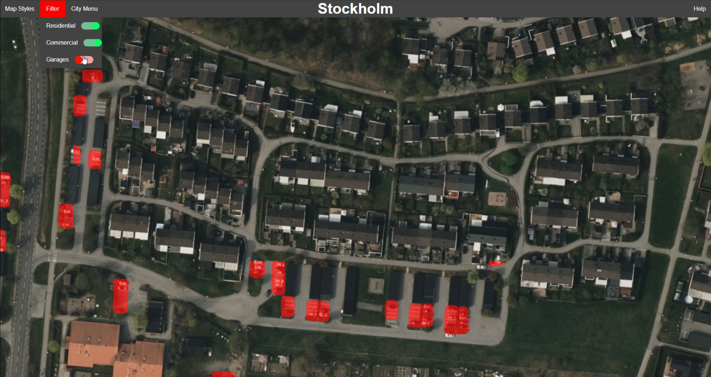

# ParkPulse-Website

<a id="readme-top"></a>
Note: Documentation is under construction.
<!-- ABOUT THE PROJECT -->
## About The Project


Frontend for the [ParkPulse](https://github.com/Marbjo07/ParkPulse) project.

In simple terms; serves as a maptile server with a basic frontend that combines the custom maptile service and azure maps. 

The mission of this project found at the complete git repo

<p align="right">(<a href="#readme-top">back to top</a>)</p>

## Tech Stack
* [![Kotlin][Kotlin-logo]][Kotlin-url]
* [![Spring Boot][Spring-logo]][Spring-url]
* [![Docker][Docker-logo]][Docker-url]
* [![JavaScript][JS-logo]][JS-url]

<p align="right">(<a href="#readme-top">back to top</a>)</p>

## Getting Started

**Note:** This server is dependent on the other reposetories to function properly. Follow the instructions at [ParkPulse](https://github.com/Marbjo07/ParkPulse) to get the full ✨experience✨.
<br>
It's also required to have a valid **Azure Map** API key

### 1. Clone the repository

```shell
git clone https://github.com/Marbjo07/ParkPulse-website.git
cd ParkPulse-website
```

### 2. Define `.env` file

``` shell
AZURE_KEY_DEV=...
SKIP_USER_AUTHENTICATION=true
```

### 3. (Optional) Build project

```shell
./gradlew.bat build -x test
```

### 4. Run the dev server

```shell
docker build -f Dockerfile -t parkpulse-web .
docker run  --env-file=.env -p 8080:8080 -t parkpulse-web
```

### 5. Open the app in your browser

Visit [http://localhost:8080](http://localhost:8080) in your browser.  
Then just press login, since authentication was disabled.

<p align="right">(<a href="#readme-top">back to top</a>)</p>

<!-- FRONTEND FEATURES -->
## Frontend Features
  
* Map Filters
* Different Map Style for the base map
* Password Reset and Account Creation Flow
* Multiple Cities

<!-- BACKEND FEATURES -->
## Backend Features

- Integrated with [BRF search engine](https://github.com/Marbjo07/BRF-Engine) ([BRF?](https://www.geringsladan.se/in-english))
- User Authetication System using Sessions and [Access Manager](https://github.com/Marbjo07/ParkPulse-AccessManager)  
- API key retrieval
- Dockerized

<p align="right">(<a href="#readme-top">back to top</a>)</p>

## Feature show case

## Color Scheme

| Color | Description                     |
|-------|---------------------------------|
| 🔴 **Red**   | Parked Residential Cars      |
| 🔵 **Blue**  | Parked Commercial Cars       |
| 🟢 **Green** | Personal Use Garages         |

### ParkPulse vs Plain map

<!-- Foreground Image (Image 2) - initially covers half of the container -->


<div style=""> 
    <div id="image-overlay" style="
        height: 640px;
        border-right: 2px dashed red;
        overflow:hidden;
        width: 500px;
        background-image:url('images/showcase-with-overlay.png');
        background-size: cover;" alt="Image 2">
    </div>
</div>
<input type="range" min="0" max="1200" value="500" style="top:40px; left: 0; width: 100%; max-width: 1200; z-index: 1;" 
oninput="document.getElementById('image-overlay').style.width = this.value + 'px'">
Locating residential housing is super simple.  

### Toggle layers

Enable/Disable garage predictions

<!-- Foreground Image (Image 2) - initially covers half of the container -->
<div style="width:100%; margin: 0; padding: 0; border: 0;">
    
    <div id="garage-filter" style="
        height: 640px;
        border-right: 2px dashed red;
        overflow:hidden;
        width: 500px;
        background-image:url('images/showcase-garages-enabled.png');
        background-size: cover;" alt="Image 2">
    </div>
</div>
<input type="range" min="0" max="1200" value="500" style="top:40px; left: 0; width: 100%; max-width: 1200; z-index: 1;" 
oninput="document.getElementById('garage-filter').style.width = this.value + 'px'">

Documentation Coming Soon...

<!-- CONTACT -->
## Contact

Marius Bjørhei - marius.bjorhei@gmail.com

Project Link: [https://github.com/Marbjo07/ParkPulse-website](https://github.com/Marbjo07/ParkPulse-website)

<p align="right">(<a href="#readme-top">back to top</a>)</p>

<!-- MARKDOWN LINKS & IMAGES -->
<!-- https://www.markdownguide.org/basic-syntax/#reference-style-links -->
[JS-logo]: https://img.shields.io/badge/JavaScript-F7DF1E?style=for-the-badge&logo=javascript&logoColor=black
[JS-url]: https://developer.mozilla.org/en-US/docs/Web/JavaScript

[Docker-logo]: https://img.shields.io/badge/Docker-2496ED?style=for-the-badge&logo=docker&logoColor=white
[Docker-url]: https://www.docker.com/

[Kotlin-logo]: https://img.shields.io/badge/kotlin-%230095D5.svg?style=for-the-badge&logo=kotlin&logoColor=black
[Kotlin-url]: https://kotlinlang.org/

[Spring-logo]: https://img.shields.io/badge/springboot-%236DB33F.svg?style=for-the-badge&logo=springboot&logoColor=white
[Spring-url]: https://spring.io/projects/spring-boot